# 🏗️ ผังโครงสร้างระบบ (System Architecture)

นี่คือภาพรวมการทำงานของระบบที่ท่านมีอยู่ และส่วนที่จะเพิ่มเติมเข้ามาในอนาคตเพื่อให้ทำงานร่วมกับ **n8n** และ **OpenClaw** ได้อย่างสมบูรณ์ครับ

## 📊 แผนผังการเชื่อมต่อ (System Diagram)

```mermaid
graph TD
    subgraph "🌍 Cloud / External"
        LS[LangSmith Tracing]
        Ext[External APIs / Webhooks]
        n8n_Cloud[n8n Cloud/SaaS]
    end

    subgraph "🔐 Tailscale Private Network"
        subgraph "🚀 Machine A: Mining Rig (Ubuntu)"
            vLLM[vLLM Engine]
            Model[Qwen 2.5 72B]
            vLLM --> Model
        end

        subgraph "🧠 Machine B: Workstation (GTX 1060)"
            Qdrant[(Qdrant Vector DB)]
            Embed[Embedding Model]
            MCP[MCP Servers]
            n8n[n8n Self-hosted]
            OC[OpenClaw Agent]
            Redis[(Redis Cache)]
            
            OC <--> n8n
            OC <--> Qdrant
            OC <--> Redis
            n8n <--> Qdrant
            n8n <--> MCP
            n8n <--> Redis
        end
    end

    %% Connections
    Client[User / Laptop / Phone] -- Tailscale --> OC
    OC -- API Call --> vLLM
    n8n -- API Call --> vLLM
    n8n -- Webhook --> Ext
    OC -- Tracing --> LS
    n8n -- Tracing --> LS
```

---

## 🛠️ รายละเอียดแต่ละส่วน (Component Roles)

### **1. ส่วนที่เป็นหัวใจหลัก (Core - Mining Rig)**
*   **vLLM (Qwen 2.5 72B)**: ทำหน้าที่เป็น **"สมอง"** (Reasoning) คอยคิดและหาคำตอบจากคำสั่งที่ได้รับ
*   **128GB Swap**: เป็น **"พื้นที่ทำงานสำรอง"** เพื่อให้แรม 16GB โหลดโมเดลยักษ์ใหญ่ได้สำเร็จ

### **2. ส่วนที่เป็นความจำและเครื่องมือ (Memory & Tools - Machine B)**
*   **Qdrant**: เป็น **"คลังความรู้อ้างอิง"** (Vector DB) สำหรับทำ RAG
*   **Embedding Model**: ตัวแปลงข้อความเป็นตัวเลข (Vector) เพื่อนำไปค้นหาใน Qdrant
*   **MCP Servers**: ชุดของ **"สกิลพิเศษ"** (เช่น ตัวอ่านไฟล์, ตัวหาข้อมูลในเครื่อง) ที่ AI สามารถหยิบมาใช้ได้
*   **Redis**: เป็น **"ความจำระยะสั้น"** (Cache) เพื่อให้การโต้ตอบเป็นไปอย่างรวดเร็ว

### **3. ส่วนการทำงานอัตโนมัติและเอเจนท์ (Automation & Agent - Future)**
*   **n8n**: เป็น **"เส้นประสาท"** (Workflow Automation) คอยเชื่อมต่อ AI กับบริการภายนอก เช่น ส่งอีเมล, แจ้งเตือน Line/Telegram, หรือดึงข้อมูลจากเว็บ
*   **OpenClaw**: เป็น **"ตัวแทนคนสำคัญ"** (AI Agent) ที่คอยรับคำสั่งจากท่าน (ผ่านแชท) แล้วไปสั่ง n8n หรือ vLLM ให้ทำงานตามที่ท่านต้องการ
*   **LangSmith**: เป็น **"กล่องดำ/กล้องวงจรปิด"** (Monitoring) ใช้ดูว่า AI คุยอะไรไปบ้าง และแต่ละขั้นตอนใช้เวลาหรือเงินไปเท่าไหร่

---

## ➕ สิ่งที่ควรมีเพิ่มเติม (Future Add-ons)

เพื่อให้ระบบทำงานร่วมกับ **n8n** และ **OpenClaw** ได้ลื่นไหลที่สุด ผมแนะนำ:
1.  **Docker & Docker Compose**: ติดตั้งบน Machine B เพื่อให้การรัน Qdrant, n8n และ OpenClaw เป็นระเบียบและจัดการง่าย (รันทุกอย่างในไฟล์เดียว)
2.  **vLLM Prefix Caching**: เปิดฟีเจอร์นี้บนเครื่องขุด เพื่อให้ AI "จำ" ประโยคยาวๆ หรือสรุปที่เพิ่งคุยไปได้แบบไม่ต้องคิดใหม่ (เร็วขึ้นมหาศาล)
3.  **Crawl4AI**: หากท่านต้องการให้ AI สามารถ **"ท่องเว็บ"** เพื่อหาข้อมูลสดๆ มาตอบคำถามได้ (เป็น MCP Server หรือ n8n node ที่ดีมาก)
