# 📊 Context Length Comparison: 4096 vs 8192

รายงานนี้เปรียบเทียบประสิทธิภาพระหว่างการตั้งค่า Context 4096 tokens (Baseline) และ 8192 tokens (Experiment) บนโมเดล Qwen2.5-72B-Instruct-GPTQ-Int8

## 📈 TPS Comparison Graph
ความเร็วในการประมวลผล (Tokens Per Second) เทียบระหว่างสองความยาว Context:

```mermaid
xychart-beta
    title "Throughput (TPS) Comparison: 4096 vs 8192"
    x-axis ["Short", "Medium", "Thai", "Extreme"]
    y-axis "TPS"
    bar [12.70, 12.19, 11.93, 11.22]
    bar [5.33, 9.83, 9.29, 9.57]
```

> [!NOTE]
> ค่า TPS ของ 8192 ในหมวด **Short** ต่ำกว่าปกติเนื่องจากรวมเวลาโหลด/Compile ครั้งแรกหลังจากรัน vLLM ใหม่ครับ หากวัดตอนเครื่องร้อนความเร็วจะสูงกว่านี้

---

## 🔍 Detailed Analysis

| Category | 4096 (TPS) | 8192 (TPS) | Performance Change |
| :--- | :---: | :---: | :---: |
| **Short** | 12.70 | 5.33 | -58% (Warmup) |
| **Medium** | 12.19 | 9.83 | -19.3% |
| **Thai-Test** | 11.93 | 9.29 | -22.1% |
| **Extreme-Fiction** | 11.22 | 9.57 | **-14.7%** |

### **บทสรุปและคำแนะนำ**
1.  **Trade-off ที่คุ้มค่า**: แม้ความเร็วเฉลี่ยจะลดลงประมาณ **15-20%** แต่เราได้พื้นที่ Context เพิ่มขึ้นถึง **2 เท่า (8,192 tokens)** ซึ่งจำเป็นมากสำหรับการทำ RAG ที่มีเอกสารยาวๆ
2.  **ประสิทธิภาพความจำ**: ที่ความยาว 8192 tokens โมเดลยังสามารถทำความเร็วได้ใกล้เคียง 10 TPS ซึ่งถือว่ารวดเร็วมากสำหรับการใช้งานจริง
3.  **ความเสถียร**: การใช้ VRAM 90% ช่วยให้ข้ามขีดจำกัดของ RAM 16GB ได้สำเร็จโดยไม่มีอาการ Killed จากระบบ

### **⏱️ Startup & Preparation Time**
เพื่อให้ระบบพร้อมใช้งาน (Ready to Inference) ท่านต้องเตรียมเวลาล่วงหน้าดังนี้:

| ขั้นตอน | 4096 Baseline | 8192 Experiment |
| :--- | :---: | :---: |
| **Model Loading** | ~20-25 นาที | ~26 นาที |
| **Graph Capture / Compilation** | ~10-15 นาที | **~33 นาที** |
| **เวลารวมเริ่มต้น (Total Startup)** | **~35-40 นาที** | **~59 นาที** |

*หมายเหตุ: 8192 ใช้เวลาเตรียม Graph นานกว่าปกติเนื่องจากต้องจอง VRAM สำหรับ KV-cache ที่ใหญ่ขึ้น*

---

## 📁 Related Results
- [4096 Baseline Folder](file:///home/seiya/projects/vllm/docs/benchmarks/4096/)
- [8192 Experiment Folder](file:///home/seiya/projects/vllm/docs/benchmarks/8192/)
