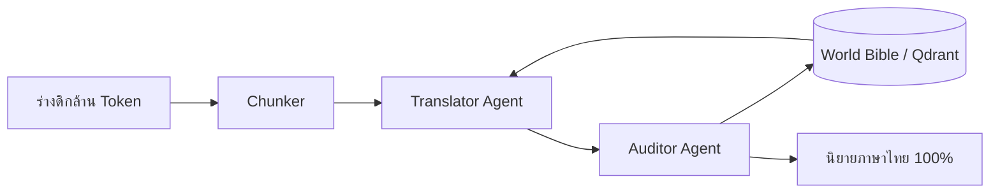

# 🌌 ยุทธศาสตร์การประมวลผลเนื้อหาระดับล้าน Token (The Million-Token Strategy)

เมื่อต้องจัดการกับเนื้อหาขนาดมหาศาล (เช่น นิยายหลายเล่มจบ) การใช้เพียง Context Window ของ AI จะไม่เพียงพอ ยุทธศาสตร์นี้เน้นการรักษา **"อรรถรส" (Flavor)** และ **"ความต่อเนื่อง" (Consistency)** ผ่านโครงสร้างแบบ Multi-Layer

## 1. การสร้าง "คัมภีร์โลก" (The World Bible)
หัวใจสำคัญไม่ใช่การส่งเนื้อหาทั้งหมดให้ AI แต่คือการส่ง **"ความลับแฝง"** ของเรื่องเข้าไปในทุกๆ รอบการแปล:
*   **Character Personas**: ฐานข้อมูลตัวละคร (นิสัย, คำพูดติดปาก, ความสัมพันธ์) เพื่อให้ตัวละครพูดเหมือนเดิมทุกบท
*   **Lore & Facts**: ข้อเท็จจริงของโลก (กฎฟิสิกส์, ประวัติศาสตร์เมือง) ป้องกัน AI "แต่งเรื่องขัดกันเอง"
*   **Style Anchor**: บทแปลตัวอย่างที่สมบูรณ์แบบสัก 1-2 ย่อหน้า เพื่อให้ AI ใช้เป็นเกณฑ์อ้างอิง

## 2. ระบบ Hierarchical RAG (ความจำแบบลำดับชั้น)
แทนที่จะดึงข้อมูลแบบสุ่ม เราใช้ระบบค้นหาที่เข้าใจโครงสร้างนิยาย:
*   **Layer 1 (Global)**: สรุปภาพรวมของนิยายทั้งล้านคำ
*   **Layer 2 (Local context)**: เนื้อหาก่อนหน้า 2-3 บทล่าสุด
*   **Layer 3 (Entity-based)**: ดึงข้อมูลเฉพาะจาก Qdrant เมื่อพบชื่อตัวละครหรือสถานที่สำคัญ

## 3. กระบวนการแปลแบบ 3 ขั้นตอน (Three-Pass Pipeline)
1.  **Pass 1: Raw Translation**: แปลตรงตัวและรักษาโครงสร้างประโยค
2.  **Pass 2: Soul & Style Infusion**: ขัดเกลาด้วย "World Bible" และ "Style Anchor"
3.  **Pass 3: Consistency Audit**: ตรวจสอบความขัดแย้งของเนื้อเรื่อง (Auditor Agent)

## 4. การคำนวณและแบ่งสัดส่วน (The 8,192 Token Math)
*   **System & Lore (1,024 Tokens)**: กฎการแปลและข้อมูลตัวละคร
*   **Running Summary (1,024 Tokens)**: สรุปเรื่องราวทั้งหมดที่ผ่านมา
*   **Active Input Chunk (4,096 Tokens)**: เนื้อหาต้นฉบับที่จะประมวลผล
*   **Reserved Output (2,048 Tokens)**: พื้นที่ว่างเผื่อไว้ให้ AI พ่นคำตอบกลับมา

## 5. เทคนิค Sliding Window with Overlap
*   **Overlap (500-800 Tokens)**: ทุกครั้งที่ตัด Chunk ใหม่ ให้ดึงเนื้อหาตอนท้ายของ Chunk เก่ามาใส่ด้วยเสมอ
*   **Recursive Summarization**: เมื่อจบ 1 Chunk ให้สรุปเหตุการณ์สำคัญเพื่อส่งต่อให้ Chunk ถัดไป

## 6. สถาปัตยกรรมทางเทคนิค (Agentic Workflow)

